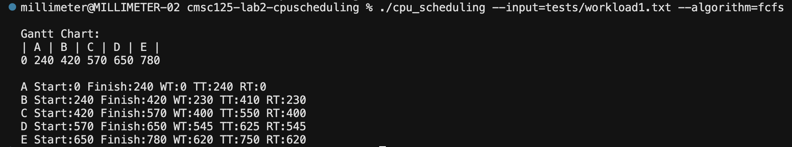
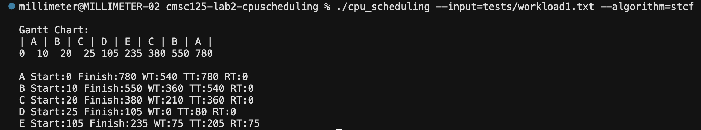
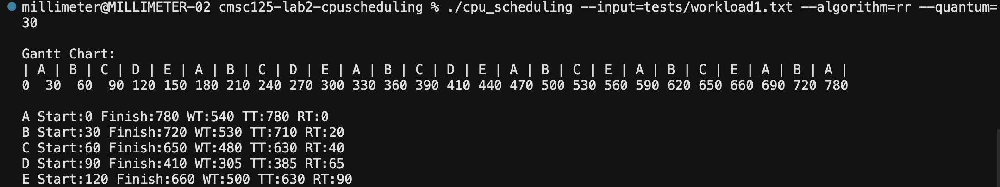
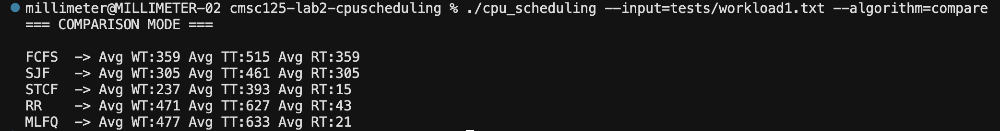
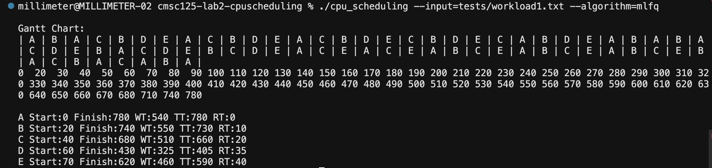
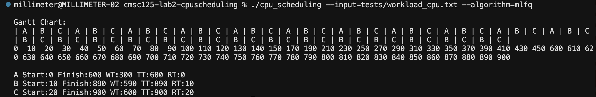
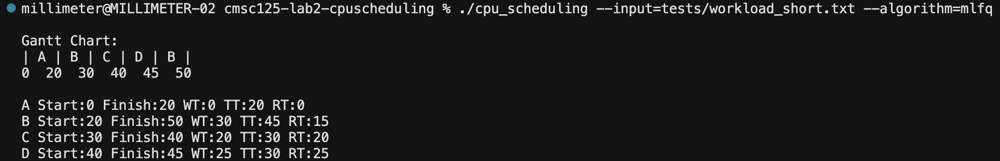
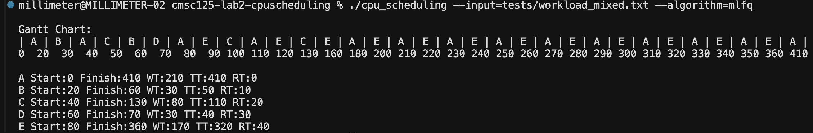

# CMSC 125 Lab 2

## CPU Scheduling Simulator

**Members**

* Ong, Christel Hope  
* Yap, Mae Maricar  

---

## Quick Start

### Compile

```bash
make
```

### Run

```bash
./cpu_scheduling --input=tests/workload1.txt --algorithm=fcfs
```

### Example (Round Robin)

```bash
./cpu_scheduling --input=tests/workload1.txt --algorithm=rr --quantum=30
```

### Example (MLFQ)

```bash
./cpu_scheduling --input=tests/workload1.txt --algorithm=mlfq
```

---

## I. Problem Analysis

The objective of this laboratory activity is to implement a **CPU Scheduling Simulator in C** that models how operating systems determine which process should execute on the CPU.

The simulator reads a workload of processes defined by:

- **PID** – Process identifier  
- **Arrival Time** – Time when a process enters the ready queue  
- **Burst Time** – Total CPU time required  

Using this workload, the simulator executes multiple scheduling algorithms and measures their performance.

### Main Challenges

- Implementing **preemption** (STCF, RR, MLFQ)  
- Handling **process arrivals during execution**  
- Designing **MLFQ without using burst time**  
- Preventing **starvation while maintaining responsiveness**  

---

## II. Supported Algorithms

The simulator supports:

### FCFS (First Come First Serve)

- Non-preemptive  
- Executes processes in order of arrival  

### SJF (Shortest Job First)

- Non-preemptive  
- Selects process with shortest burst time  

### STCF (Shortest Time to Completion First)

- Preemptive  
- Always runs process with smallest remaining time  

### Round Robin (RR)

- Preemptive  
- Uses fixed time quantum  
- Processes cycle through ready queue  

### Multi-Level Feedback Queue (MLFQ)

- Multi-level priority queues  
- Uses behavior-based scheduling  
- Includes **priority boosting**  
- Does **not rely on burst time**  

---

## III. Input Format

Workload file example:

```
# PID ArrivalTime BurstTime
A 0 240
B 10 100
C 20 150
```

- Lines starting with `#` are ignored  
- All values must be valid (non-negative, burst > 0)  

---

## IV. Output

Expected Outputs for the ff. algorithms:
### FCFS


### SJF


### STCF


### RR


### Comparison


### MLFQ


MLFQ handling different workload types:








### 1. Gantt Chart

Displays execution timeline:

```
Gantt Chart:
| A | B | C |
0   10  20  30
```

---

### 2. Per-Process Metrics

Each process reports:

- Start Time  
- Finish Time  
- Waiting Time (WT)  
- Turnaround Time (TT)  
- Response Time (RT)  

---

### 3. Comparison Mode

Run all algorithms:

```bash
./cpu_scheduling --input=tests/workload1.txt --algorithm=compare
```

Outputs average metrics for each scheduling policy.

---

## V. MLFQ Configuration

| Queue | Quantum | Allotment |
|------|--------|-----------|
| Q0   | 10     | 50        |
| Q1   | 20     | 100       |
| Q2   | FCFS   | Unlimited |

### Behavior

- New processes enter **Q0**  
- Processes accumulate `time_in_queue`  
- Demotion occurs only when **allotment is exceeded**  
- Priority boost occurs every **100 time units**  
- All processes return to Q0 during boost  

---

## VI. Features

- Multiple scheduling algorithms  
- Preemptive and non-preemptive execution  
- Dynamic Gantt timeline (heap-allocated)  
- Input validation and error handling  
- Command-line flag parsing (`--input`, `--algorithm`, `--quantum`)  
- Comparison mode for performance evaluation  

---

## VII. Error Handling

The simulator checks for:

- Negative arrival times  
- Zero or negative burst times  
- Invalid quantum values  
- File input errors  

Errors are printed using `fprintf(stderr, ...)` and `perror()` when applicable.

---

## VIII. Known Limitations

- MLFQ queues use fixed-size arrays  
- Timeline has fixed capacity (may truncate long executions with warning)  
- No support for inline process input (`--processes`)  
- Assumes correct file formatting  

---

## IX. Implementation Notes

- Each scheduling algorithm is implemented in a separate module  
- Uses discrete-time simulation  
- MLFQ does not use burst time (follows specification)  
- Modular structure improves readability and maintainability  

---

## X. Summary

This project simulates CPU scheduling behavior using multiple algorithms. It demonstrates key operating system concepts such as preemption, fairness, responsiveness, and priority-based scheduling while maintaining a clean and modular implementation.